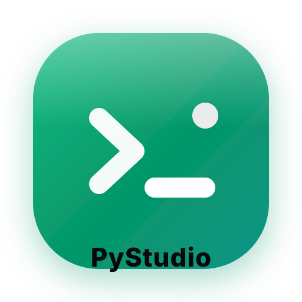
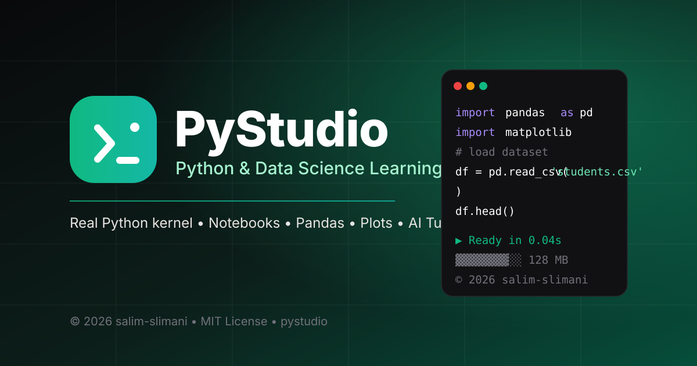

<p align="center">
  <a href="https://github.com/salim-studio/pystudio">
    
  </a>
</p>

<h1 align="center">PyStudio</h1>

<p align="center"><strong>Python & Data Science Learning Platform</strong><br />
Interactive notebooks with a real Python kernel, variable inspector, package manager, charts, DataFrames, and AI tutor.
</p>

<p align="center">
  <a href="https://github.com/salim-studio/pystudio"></a>
  
  
  
  
</p>

<p align="center">
  
</p>

---

## ✨ What is PyStudio?

PyStudio is a modern, browser-based **Python learning studio** for students, educators, and data teams. Write Python cells, run them instantly on a persistent server-side kernel, inspect variables, upload CSV datasets, generate EDA reports, visualize with Matplotlib/Seaborn, and learn faster with the built-in AI tutor.

Built for clarity: beginner-friendly by default, powerful when you need it with Pro mode.

## 🎯 Key Features

- **Real persistent Python 3.10 kernel** — variables and imports stay in memory across cells
- **Notebook editor** — code + markdown cells, run with `Shift + Enter`, run-all, duplicate, reorder
- **Rich outputs** — stdout/stderr, DataFrames, high-resolution Matplotlib plots, LaTeX via SymPy
- **Variable inspector** — live view of the kernel namespace
- **Package manager** — install/uninstall Python packages from the UI
- **Dataset workflows** — upload CSV, open as DataFrame, one-click automated EDA report
- **Courses & exercises** — guided lessons and testable coding challenges with hints and solutions
- **AI tutor** — explain code, debug errors, suggest optimizations (Gemini-powered)
- **Client fallback** — Pyodide WASM execution if the server is restarting
- **Trilingual UI** — English, French, Arabic (with RTL support)
- **Dark / light theme**, beginner / pro modes

## 🖼️ Visual Identity

| Asset | Path | Usage |
|---|---|---|
| Logo | `public/logo.svg` | README, header, about pages |
| Favicon | `public/favicon.svg` | Browser tab, PWA icon |
| Social banner | `public/pystudio-banner.svg` | GitHub social preview, docs header |

- **Primary:** Emerald `#10B981`
- **Accent:** Teal `#0D9488`
- **Ink:** Zinc-950 `#09090B`
- **Font (UI):** Inter / system sans
- **Font (code):** JetBrains Mono / Consolas

See [`BRANDING.md`](BRANDING.md) for logo rules, colors, and tone of voice. All copy in this repository is in **English**.

## 🚀 Quick Start

### Prerequisites

- Node.js 20+ (or Bun)
- Python 3.10+ with `pip`

### 1. Clone

```bash
git clone https://github.com/salim-studio/pystudio.git
cd pystudio
```

### 2. Configure environment

```bash
cp .env.example .env
# set GEMINI_API_KEY for the AI tutor
```

### 3. Install and run

```bash
npm install
npm run dev
```

Open `http://localhost:3000`.

### 4. Python kernel dependencies

```bash
pip install -r workspace/requirements.txt
```

### Production build

```bash
npm run build
npm start
```

## 📁 Project Structure

```text
pystudio/
├── public/
│   ├── favicon.svg            # browser icon
│   ├── logo.svg               # main logo
│   └── pystudio-banner.svg    # social / docs banner
├── src/
│   ├── components/            # toolbar, sidebar, notebook, output, AI tutor
│   ├── data/                  # courses and exercises
│   ├── lib/                   # API client, Pyodide fallback
│   ├── App.tsx
│   └── main.tsx
├── workspace/                 # sample notebooks, datasets, scripts
├── py_kernel.py               # persistent Python kernel
├── server.ts                  # Express + Vite server
└── index.html
```

## ⌨️ Shortcuts

| Action | Shortcut |
|---|---|
| Run cell | `Shift + Enter` |
| Run and select next | `Shift + Enter` at last cell creates a new cell |
| Save notebook | Toolbar save button |
| Export `.ipynb` | Toolbar download button |

## 🌍 Languages

Use the `EN / AR / FR` switcher in the top toolbar. Arabic enables full RTL layout.

## 🤝 Contributing

Issues and pull requests are welcome. Please write code comments, commit messages, and documentation in English and keep the visual identity consistent (see `BRANDING.md`).

## 📄 License

MIT License — see [`LICENSE`](LICENSE).

---

<p align="center">
  <br />
  <strong>Copyright © 2026 salim-slimani. All rights reserved.</strong><br />
  PyStudio — Learn Python by doing.
</p>
